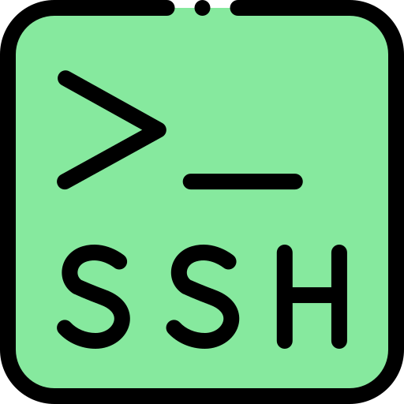
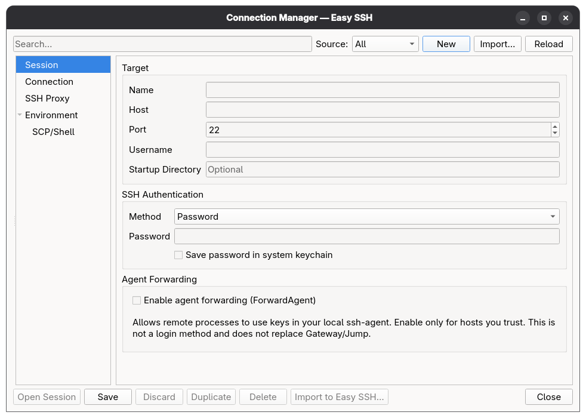
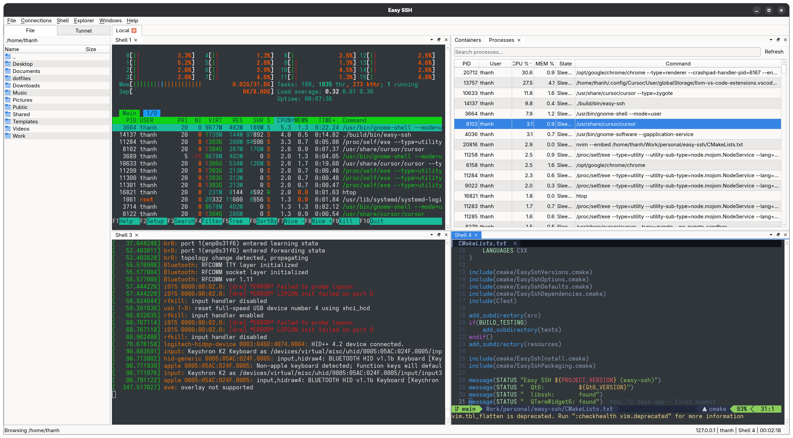
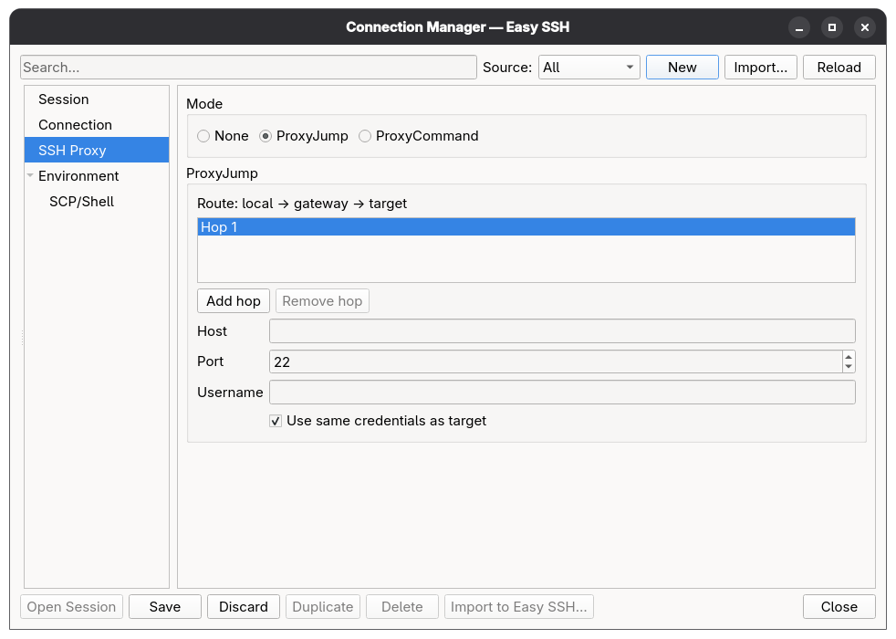
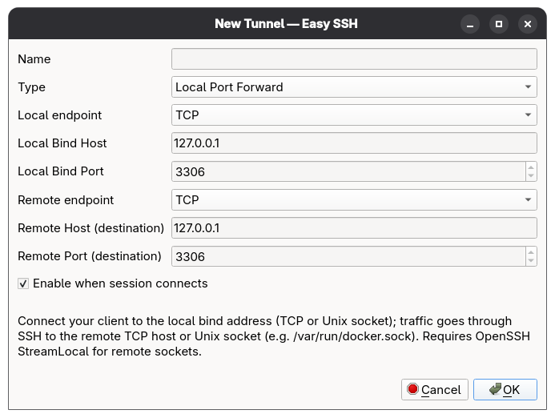

<p align="center">
  
</p>
<h1 align="center">
  Easy SSH
</h1>
<p align="center">
  <em>A lightweight, native SSH client that puts the full SSH protocol to work</em>
</p>

<p align="center">
  <a href="https://github.com/magiskboy/easy-ssh/actions/workflows/ci.yml">
    
  </a>
  <a href="LICENSE">
    
  </a>
</p>

## Features

- **Cross-platform** — native desktop app on Linux, macOS, and Windows (Qt 6 + libssh)
- **Auth** — password or OpenSSH private key; optional keychain storage; agent forwarding; ProxyJump / ProxyCommand
- **Tunnels** — local, remote, and dynamic SOCKS5; Unix domain sockets (StreamLocal); live status per connection
- **Shell** — multi-tab sessions with split dock layouts, ANSI / UTF-8, search, logs, and screenshots
- **Files** — remote explorer over SFTP (with resume); SCP fallback when SFTP is unavailable
- **Shortcuts** — command palette, Quick Connect, and Go to Shell — VS Code–style keyboard-first navigation
- **Explorers** — Process, Container (Docker / Podman / containerd), Service (systemd + live logs), and System Information (CPU, RAM, disk, NVIDIA GPU)
- **Appearance** — built-in light / dark / custom themes; configurable UI font and palette; system tray with live session status
- **Workspace** — sessions and shell dock layouts restored automatically on next launch

## Screenshots

| | |
|:---:|:---:|
| <br>Connection Manager | <br>Split Window |
| <br>SSH Proxy | <br>New Tunnel |

## Install

Download the latest build for your platform from
[GitHub Releases](https://github.com/magiskboy/easy-ssh/releases/latest)
(Linux: `.deb` / `.rpm` / `.AppImage` / `.tar.gz`; macOS: `.dmg`; Windows: NSIS `.exe`).

Or install with one command (Linux / macOS):

```bash
curl -fsSL https://raw.githubusercontent.com/magiskboy/easy-ssh/main/installer.sh | bash
```

## Contributing

Contributions are welcome — bug reports, feature ideas, documentation, and pull requests.

Please read **[CONTRIBUTING.md](CONTRIBUTING.md)** before opening an issue or PR.

## License

Easy SSH is licensed under the [GNU General Public License v3.0](LICENSE).

Source files carry [SPDX](https://spdx.dev/) headers; the tree aims to stay
[REUSE](https://reuse.software/)-compliant (`REUSE.toml`, `LICENSES/`).

Third-party components are listed in [NOTICE](NOTICE) and remain under their own licenses.
